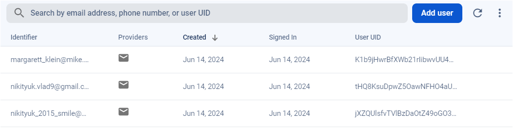
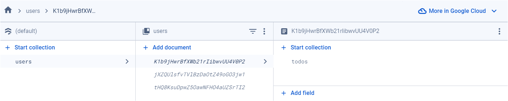
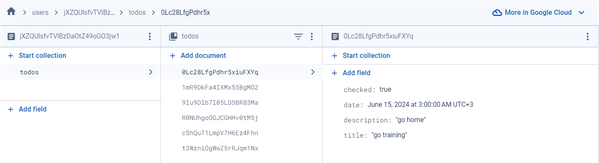

# TaskerToDo

## 1. About project:

The essence of the application: a task manager that allows you to plan tasks according to days. The application consists of 3 parts:

1. Authorization / registration; Sign in and Register are 2 different pages, different routes in the application.

2. View tasks by day; This item consists of two main blocks: a calendar for viewing tasks and the list itself.

3. Page for creating/editing a task; user can set
   title, description and date of the task; “Save” / “Update” button depending depends on whether we edit the task or create it.

Under each day in the calendar there are 2 dots,
reflecting what type of tasks there are on this day: completed and unfulfilled. If there are uncompleted tasks in the day: a dark dot is shown, if completed -
A lighter dot is shown nearby. Built a calendar in the following way: inhorizontal line show all remaining days of the current month (from today to
last day of the month). Of course, tasks have a “done” status. The checkbox to the left of the task does this function.

Implemented Theme management. The ability to easily change the application color scheme from app.

Implemented “endless scrolling” in the calendar. In the basic version of the task, it is necessary to provide the user with the ability to view tasks for the current month: from today until the end of the month.

## 2. Requirements:

(https://drive.google.com/file/d/18I1PxOxZn2lwm__YeOtMNoWeiXygKwwN/view)

1. Using React-Redux/Vuex for React/Vue is not required; use is only permitted if you already familiar with the ecosystem and have had experience managing state through external utilities before.

2. For routing in an application in React and Vue, you can use third-party libraries. In Angular - use the built-in Angular Router. Important: if the user is not authorized, he should not be allowed to the page for creating or viewing tasks.

3. Before development, you need to configure ESLint for the application. As an add-on, you can configure Prettier and link it with ESLint. Including, you need to implement a pre-commit hook, which will not allow you to push to the repository if the application contains ESLint errors.

4. Competent work with the database. If possible, the client should make as few requests as possible. A trivial example of not the most optimal use: make a separate request for tasks for each day. That is, for 30 days of the month, 30 requests fly away. You can try to optimize this using Firebase Database Query.

5. Handling errors from the server: if the user tries
   log in with incorrect data - Firebase will return an error, and this should be displayed to the user on the screen in the form of some kind of Toast (for this, for speed of implementation, you can use some third-party library).

## 3. Technologies

- Vue 3, Vuex, Vue Router, JS, CSS
- Firebase

## 4. How to run the application

Clone the repository:

```sh
$ git clone
```

Run the app with any server you use, for example, "Live Server"

Install dependencies:

```sh
$ npm install
```

Compile and Hot-Reload for Development:

```sh
$ npm run dev
```

Compile and Minify for Production:

```sh
$ npm run build
```

# 5. Database Snapshots

Structure of users and data in firebase:







## 6. Structure of the project:

In the root folder are main folders and files of the app, including `index.html`, to configure the app.

`src` (Source) - contains the source code of the project. It often includes subdirectories for different types of source files along with the main source files that drive the application's functionality. It has `assets`, `components`, `firebase`, `router`, `utils` folders and main files for initializing the app.

`assets` - has logo and stylesheets files.

`components` - has components and modules of the application. It could include subdirectories further categorizing different types of components used in the application.

`api` - files for requests to Firebase.

`auth` - includes authentication-related components.

`composables` - includes composable for logic of loading.

`icons` - includes icons, used in the app.

`store` - includes global state of the app.

`views` - holds files or subdirectories representing different views or pages of the application.

`loader` - component for loader of the app.

`firebse` - initializing the firebase database and auth.

`router` - include file responsible for routing of the app.

`utils` - utility modules or helper functions used across the project.
